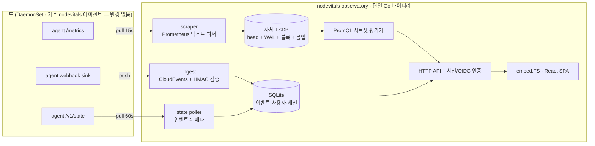

# nodevitals-observatory — 설계 스펙 (v0.1)

> **상태** Draft · 작성 2026-07-24 · **대상 repo** `github.com/KeiaiLab/nodevitals-observatory` (신규)
> **에이전트 repo** <https://github.com/KeiaiLab/nodevitals> (본 문서 소재 · 동반 변경 대상)
> 코드 식별자·스키마 필드·CLI 플래그는 영어, 서술은 한국어.
> <!-- live-verified: 2026-07-24 -->

**한눈에** — nodevitals 에이전트가 노드에서 뽑는 하드웨어 텔레메트리를 **수집·저장·질의·시각화·인증까지 전부 자체 구현한 단일 Go 바이너리**로 관제한다. Prometheus·VictoriaMetrics·Grafana 는 **레퍼런스일 뿐 런타임 의존이 아니다** — 자체 TSDB 엔진(Gorilla 압축 + WAL + 블록), 자체 PromQL 서브셋 평가기, 자체 웹 UI(React + shadcn/ui, Go `embed.FS`)를 갖는다. 결과적으로 **차트 하나 = 파드 하나 = 완결**이며 subchart·외부 서비스 의존이 0이다.

---

## 1. Context (왜 만드는가)

### 1.1 트리거

2026-07-24 사용자 요청: *"nodevitals 확장, 데몬셋과 웹서비스를 추가해서 해당 서비스에서 관제도 가능하게 하며 접근제어도 추가해서 로그인/아웃이 가능하게 처리"*. 이후 브레인스토밍에서 확정된 결정:

| 결정 | 값 | 근거 |
|---|---|---|
| 배치 | **별도 OSS repo** (`nodevitals-observatory`) | 에이전트의 단일 바이너리 순수성 유지, 독립 릴리스 주기 |
| 데이터 경로 | **하이브리드** (push 이벤트 + pull 스크레이프) | 두 표면의 성격이 달라 서로를 대체 못 함 (§3) |
| 인증 | **로컬 계정 기본 + OIDC 옵션** | OSS 단독 사용자는 의존성 0, keiailab 은 SSO |
| 저장 | **자체 TSDB 엔진** | 외부 TSDB 의존 제거 — 자급자족 (§4) |
| 질의 | **PromQL 서브셋 재구현** | 문법 호환으로 기존 지식·쿼리 재사용 (§5) |
| UI | **shadcn/ui 기반 컴포넌트 재사용** | 3화면 풀 구현, 컴포넌트 재사용성 우선 (§7) |
| 보존 | **raw 7일 + 5분 롤업 90일** | 정밀 진단(최근) + 추세(장기) 양립 (§8) |

### 1.2 제품 경계의 이동 — 무엇이 바뀌고 무엇이 유지되나

nodevitals 에이전트의 문서 3곳이 UI 계층을 명시적 비목표로 선언해 왔다:

- `README.md` — *"It does not try to be a dashboard — you keep your own Grafana/backend."*
- `docs/superpowers/specs/2026-07-17-nodevitals-design.md` §2 Non-Goals — *"턴키 대시보드/UI — 고객이 자체 UI 보유 (재발명 금지)"*
- `docs/superpowers/specs/2026-07-20-nodevitals-ai-insight-gap.md` §3 — *"GPU Map / GPU Explorer / Overview UI — 시각화 계층. Grafana/자체 백엔드가 nodevitals 의 `/metrics`·webhook·REST 를 소비해 구현"*

**본 설계는 이 비목표를 철회하지 않는다.** 에이전트는 계속 순수 텔레메트리 소스로 남고, 그 문서들이 "소비 백엔드의 책임"이라 위임해 둔 계층을 **별도 제품**이 구현한다. 따라서 에이전트 repo 의 문서 수정은 *위임 대상의 이름을 적는 것*에 그친다 (§10.2).

### 1.3 자체 구현이 현실적인 이유 (실측 근거)

Prometheus·VictoriaMetrics 가 복잡한 근본 이유는 **임의 라벨 조합에서 수백만~수천만 시리즈**와 카디널리티 폭발을 견뎌야 한다는 점이다. nodevitals 는 그 문제를 갖지 않는다:

- **스키마가 고정** — `model.Sample{Node, Tier, Device, Metric, Kind, Value, Labels, Timestamp}`. 라벨 집합이 수집기에서 결정되며 사용자 입력으로 폭발하지 않는다.
- **카디널리티가 유계** — 시리즈 수가 노드 수에 선형. 아래 실측 참조.
- **질의 패턴이 정형** — 관제 3화면이 던지는 질의는 최신값 / 시간범위 / 축 집계 세 종류.

즉 재구현 대상은 "범용 TSDB" 가 아니라 **"고정 스키마 시계열 저장소"** 이며, 난이도가 한 자릿수 이상 낮다.

### 1.4 라이브 실측 (2026-07-24)

```
$ kubectl get nodes -o custom-columns=NAME:.metadata.name,CPU:.status.capacity.cpu,GPU:'.status.capacity.nvidia\.com/gpu'
NAME   CPU   GPU
e101   12    1        e102   12    1        e103   12    1
e104   12    1        e105   12    1        e106   12    1
e121   32    2        e122   32    2        e21    32    3        e22    32    5

$ kubectl get pods -n platform-system -l app.kubernetes.io/name=nodevitals
nodevitals-{7hdvk,nxp9r,fsdwm,qgftm,sxcxv,bmthb,csvrx,62hgp,n2v57,w4zzj}   1/1 Running   (10/10)
```

노드 10대 · GPU 18장 · nodevitals 10파드 가동 중 (hostNetwork — 파드 IP = 노드 IP).

```
$ curl -s http://10.31.10.101:9847/metrics   # e101 (12코어 · GPU 1)
TOTAL_LINES=4522   SERIES=3800   FAMILIES=361
NODEVITALS_SERIES=358   NODE_SERIES=3422
```

**노드당 3,800 시리즈이고 그중 90%(3,422)가 node_exporter 표면이다.** 이 비율이 §8 의 선택적 수집 설계를 정당화한다.

---

## 2. Goals / Non-Goals

### Goals (v0.1)

- 외부 시계열 DB·대시보드 서비스 **의존 0** 으로 관제가 성립한다 (단일 이미지 · 단일 파드)
- nodevitals 에이전트의 기존 3표면(`/metrics`·webhook·`/v1/state`)을 **에이전트 변경 없이** 소비한다
- PromQL **문법 호환** 질의를 자체 평가기로 처리한다 (`/api/v1/query`, `/api/v1/query_range`)
- 로그인/로그아웃 기반 접근제어 — 로컬 계정 기본, OIDC 옵션, 역할 2종
- 관제 3화면 — Overview / Map / Explorer
- 하드웨어 0대에서 결정론 개발·테스트 (에이전트 repo 관례 계승)

### Non-Goals (v0.1 — 의도적 제외)

- **알림 발송(routing/silencing)** — 이벤트 *생성*은 에이전트가 이미 한다. 관제는 표시까지. Alertmanager 대체는 v2 백로그.
- **로그·트레이스** — Loki/Tempo 영역. 메트릭·이벤트만.
- **`remote_write` 수신** — 범용 Prometheus 대체 경로는 v2 백로그 (§5.3 이 문을 열어 두되 구현하지 않음).
- **멀티테넌시** — 단일 조직 단일 클러스터 가정. `cluster` 라벨로 멀티클러스터 *집계*는 지원하나 테넌트 격리는 안 함.
- **에이전트 원격 설정 변경** — 관제는 읽기 전용. 쓰기 경로는 GitOps(Helm values)가 SSOT.
- **PromQL 전 기능** — 서브셋 범위는 §5.2 에 확정 명시.

---

## 3. 아키텍처



**세 경로가 각기 다른 것을 가져온다** — 하나로 대체 불가:

| 경로 | 전송 | 주기 | 얻는 것 | 왜 필요한가 |
|---|---|---|---|---|
| **scrape** | `GET /metrics` (Prometheus 텍스트) | 15s | 시계열 전량 (자체 358 + node_exporter 3,422) | `/v1/state` 에는 node_exporter 표면이 **없다** (§3.1) |
| **push** | `POST /api/v1/ingest/events` (CloudEvents 1.0 + HMAC) | 이벤트 발생 시 | 상태전이 이벤트 | 스크레이프 간격 사이에 발생·해소된 전이를 놓치지 않음 |
| **state** | `GET /v1/state` (JSON) | 60s | 인벤토리·메타 (디스크 모델/시리얼, GPU UUID/모델, tier 구성) | `Sample.Labels` 의 문자열 메타는 시계열이 아니라 인벤토리 |

### 3.1 결정적 실측 — `/v1/state` 와 `/metrics` 의 범위가 다르다

`cmd/nodevitals/main.go:89-100` 은 임베드 node_exporter collector 를 `metrics.Register(c)` 로 **Prometheus registry 에만** 등록한다. `internal/agent/agent.go:64-65` 의 `Snapshot()` 은 nodevitals 자체 수집기의 `[]model.Sample` 만 반환한다.

⇒ **CPU·메모리·디스크 I/O·네트워크 상세는 `/metrics` 에만 존재한다.** Explorer 화면이 이 데이터를 필요로 하므로 **Prometheus 텍스트 포맷 스크레이퍼 구현은 선택이 아니라 필수**다.

부수 효과: 텍스트 파서를 갖게 되므로 nodevitals 외 임의 exporter 수집도 원리상 가능해진다 — v2 에서 범용 대체로 확장하는 문을 열어 두되, v0.1 범위에는 넣지 않는다.

### 3.2 타겟 발견

| 모드 | 방법 | 대상 |
|---|---|---|
| `kubernetes` | 파드 목록 조회 (`app.kubernetes.io/name=nodevitals` 셀렉터, 읽기 전용 ClusterRole: `pods`·`nodes` get/list/watch) | 클러스터 내 배포 |
| `static` | values 의 URL 목록 | VM·베어메탈 (에이전트가 `nodevitals -config` 단독 실행되는 경우) |

`nodes` 읽기 권한은 상태 6분류의 `Pending` 판정(§7.3)에 쓰인다.

---

## 4. 저장 계층 — 자체 TSDB 엔진

### 4.1 구조

```
data/
  wal/                     # append-only, head 재구성용
    00000042.wal
  head/                    # 인메모리 (디스크 표현 없음)
  blocks/
    01J.../                # 2시간 단위 불변 블록
      meta.json            # minTime, maxTime, seriesCount, resolution
      index                # 라벨 → posting list, seriesID → 청크 오프셋
      chunks/000001        # Gorilla 압축 청크
    01K.../                # resolution: "5m" 롤업 블록
```

- **시리즈 식별** — 라벨셋을 키 정렬 후 해시 → `seriesID (uint64)`. 충돌은 라벨셋 원본 비교로 해소.
- **역색인** — `labelName=labelValue` → 정렬된 seriesID 슬라이스(posting list). 교집합은 정렬 병합. 시리즈 규모(수만)에서 roaring bitmap 은 과설계 — 정렬 슬라이스로 충분.
- **Head** — 최근 2시간을 인메모리 가변 청크로 보유. flush 시 불변 블록으로 승격.
- **WAL** — head 에 들어간 모든 append 를 먼저 기록. 재시작 시 재생하여 head 복구. 블록 flush 성공 후 해당 구간 WAL segment 삭제.
- **압축** — Gorilla: 타임스탬프 delta-of-delta 가변길이, 값 XOR + leading/trailing zero 인코딩. 하드웨어 메트릭은 변화가 느려 압축률이 특히 좋다.
- **리텐션** — 블록 `meta.json` 의 `maxTime` 기준. raw 7일 / 롤업 90일 초과 시 **디렉터리 통째 삭제**. Prometheus 식 컴팩션 머신은 이 규모에서 불필요.

### 4.2 롤업 (다운샘플링)

블록 flush 시 같은 구간의 5분 롤업 블록을 **동시 생성**한다. 저장 값은 `sum` · `count` · `min` · `max` 4종 (평균은 `sum/count` 로 유도 — 별도 저장 불필요, 재집계 시 정확).

### 4.3 해상도 자동 선택

`query_range` 의 `(start, end, step)` 으로 서버가 결정한다:

| 조건 | 선택 |
|---|---|
| `step < 5m` **그리고** 범위가 raw 보존(7일) 안 | raw 블록 |
| 그 외 | 롤업 블록 |
| 범위가 두 보존 구간에 걸침 | 구간별로 나눠 읽고 병합 |

응답 포인트 수는 `step` 으로 이미 유계이며, UI 는 화면 픽셀 수(~1,000)에 맞춘 `step` 을 보낸다 (§7.4).

### 4.4 정확성 경계

이 설계에서 **정확성이 걸린 유일한 지점은 WAL** 이다. 다른 부분은 틀리면 화면이 이상해지는 정도지만, WAL 이 틀리면 재시작 시 **조용히 데이터가 사라진다**. 그래서 M1 의 완료 기준을 "크래시 주입 후 복구 왕복 동일성"으로 잡아 위험을 첫 마일스톤에 가둔다 (§11).

---

## 5. 질의 계층 — PromQL 서브셋

### 5.1 구성

`lexer → parser → AST → evaluator` 4단. 평가기는 TSDB 의 `Querier` 인터페이스(`Select(matchers, start, end) SeriesSet`)에만 의존해 저장 구현과 분리한다.

### 5.2 지원 범위 (확정)

**v0.1 지원:**

| 분류 | 항목 |
|---|---|
| 셀렉터 | 벡터 셀렉터, 범위 셀렉터 `[5m]`, 매처 `=` `!=` `=~` `!~` |
| 함수 | `rate` `irate` `increase` `delta` `idelta` `abs` `ceil` `floor` `round` `clamp_max` `clamp_min` `histogram_quantile` `time` `timestamp` |
| 집계 | `sum` `avg` `min` `max` `count` `stddev` `stdvar` `topk` `bottomk` `quantile` + `by` / `without` |
| 이항 연산 | 산술 `+ - * / % ^`, 비교 `== != > < >= <=` (+`bool`), 논리 `and` `or` `unless` |
| 벡터 매칭 | `on` / `ignoring` + `group_left` / `group_right` |
| API | `/api/v1/query`, `/api/v1/query_range`, `/api/v1/series`, `/api/v1/labels`, `/api/v1/label/<name>/values` (Prometheus HTTP API 응답 스키마 호환) |

**v0.1 제외 (v2 백로그로 명시):** subquery `[5m:1m]` · `offset` · `@` modifier · `label_replace` `label_join` · `predict_linear` `holt_winters` `*_over_time` 계열 일부 · `absent` `absent_over_time` · remote_write 수신.

### 5.3 왜 서브셋인가

관제 3화면이 실제로 던지는 질의는 세 종류(최신값·시간범위·축 집계)뿐이다. 전체 PromQL 은 그 자체로 별개의 대형 프로젝트이며, 화면이 쓰지 않을 기능을 지느라 제품이 늦어진다. 다만 **문법은 호환**이므로 사용자가 기존 지식으로 임의 쿼리를 쓸 수 있고, 미지원 문법은 파서가 명시적 에러("unsupported in v0.1: subquery")로 알린다 — 조용히 틀린 답을 내지 않는다.

### 5.4 검증 — 골든 테스트

재구현의 진짜 위험은 파서가 아니라 **벡터 매칭**(`on`/`ignoring` + `group_left/right` 의 다대일 조인 의미론)이다. 검증은 Prometheus 공식 테스트 포맷을 차용한 골든 테스트로 고정한다:

```
load 15s
  node_cpu_seconds_total{node="e101",cpu="0",mode="idle"}  0+10x20
  node_cpu_seconds_total{node="e101",cpu="1",mode="idle"}  0+8x20

eval instant at 5m sum by (node) (rate(node_cpu_seconds_total[1m]))
  {node="e101"} 1.2
```

---

## 6. 접근제어

| 항목 | 설계 |
|---|---|
| 로컬 계정 | argon2id 해시. 초기 admin 비밀번호는 K8s Secret 주입(`auth.adminPasswordSecret`), 미지정 시 랜덤 생성 후 **기동 로그에 1회** 출력 |
| 세션 | 서버측 세션 테이블(SQLite) + 쿠키 `HttpOnly` `Secure` `SameSite=Lax`. 로그아웃 = 세션 행 즉시 삭제 (토큰 폐기 불가 문제 회피) |
| 만료 | 유휴 8시간 / 절대 7일. 슬라이딩 갱신 |
| OIDC | 옵션(`auth.oidc.enabled`). Authorization Code + PKCE. `groups` 클레임 → 역할 매핑(`auth.oidc.roleMapping`) |
| 역할 | `admin`(사용자·설정 변경) / `viewer`(읽기 전용). 그 이상은 YAGNI |
| 감사 | 로그인 성공·실패, 로그아웃, 사용자 생성·삭제·역할 변경만 SQLite 에 기록 |
| 보호 범위 | **모든** API 와 SPA 경로. 예외 4종: `/healthz` · `/readyz` · `POST /api/v1/auth/login` 과 OIDC 콜백 · `POST /api/v1/ingest/events`(HMAC 으로 별도 인증) |

로그인 실패는 계정 존재 여부를 노출하지 않는 단일 메시지 + 지수 백오프.

**질의 API 도 인증 대상이다.** `/api/v1/query` 계열이 Prometheus HTTP API 스키마와 호환이지만 세션 인증을 요구하므로, 외부 Prometheus 클라이언트가 그대로 붙지는 않는다. 자급자족 설계에서 이 API 의 소비자는 자체 UI 뿐이므로 의도된 제약이며, 외부 연동이 필요해지면 v2 에서 읽기 전용 API 토큰을 추가한다.

---

## 7. 웹 UI

### 7.1 스택

React + TypeScript + Vite + Tailwind + **shadcn/ui**. 빌드 산출물을 Go `embed.FS` 로 바이너리에 포함 — 이미지 1개, 런타임 의존 0. shadcn/ui 는 컴포넌트를 repo 안으로 복사해 소유하는 방식이라 외부 런타임 의존이 늘지 않고 커스터마이즈가 자유롭다.

공통 셸: `sidebar` + `command`(⌘K 팔레트) + `breadcrumb` + 라이트/다크 테마.

### 7.2 화면 3종

| 화면 | 구성 | 주 데이터원 |
|---|---|---|
| **Overview** | `card` KPI 타일(노드·GPU·디스크 수, severity 별 활성 알람) + `table` 최근 이벤트 + 스파크라인 | 이벤트 + 최신값 질의 |
| **Map** | 노드 × 디바이스 히트맵 그리드(셀=SVG, `hover-card` 상세) + 상태 6분류 범례 + 필터 | 최신값 + 이벤트 + K8s 노드 컨디션 |
| **Explorer** | `resizable` 2단 + `combobox` 시리즈 선택 + 시계열 차트 + 이벤트 타임라인 + `table` SMART/GPU 속성 | `query_range` + 이벤트 이력 + 인벤토리 |

### 7.3 상태 6분류 — 출처를 나눈다

| 상태 | 판정 근거 | 계산 위치 |
|---|---|---|
| `Active` / `Idle` | 사용률 샘플 임계 | **observatory** |
| `Warning` / `Critical` | 활성 이벤트의 최고 severity | **observatory** (이벤트는 에이전트 생성) |
| `Pending` | K8s 노드 컨디션 (`NotReady`, `SchedulingDisabled` 등) | **observatory** (K8s API — 에이전트가 알 수 없는 정보) |
| `AgentMissing` | 스크레이프 실패 + push 침묵 | **observatory** |

**분류 정책을 에이전트가 아니라 observatory 에 두는 것이 설계 판단이다.** "80% 사용률이 Active 인가 Warning 인가"는 정책이고, 정책은 노드마다 흩어진 에이전트 N개가 아니라 소비자 한 곳에 있어야 바꾸기 쉽다. 이 판단의 결과로 `ai-insight-gap.md` 의 **G5(GPU 복합 상태 롤업)와 G7(liveness heartbeat)이 에이전트 백로그에서 제거된다** — G7 은 하이브리드 경로 덕에 *스크레이프 실패 자체가 부재 신호*라 불필요해진다.

### 7.4 차트 성능 — 서버측 step 다운샘플링

shadcn 의 `chart` 는 Recharts 래퍼라 수만 포인트에서 느려진다. 서버가 이미 `step` 과 롤업 해상도를 다루므로 **응답 포인트를 화면 픽셀 수(~1,000)로 제한**해 내려주면 문제가 사라진다. 자체 Canvas 렌더러를 만들 이유가 없고, 컴포넌트 재사용 요구도 그대로 지켜진다.

---

## 8. 용량 산정 (실측 기반)

### 8.1 시리즈 수

| 노드군 | 대수 | 노드당 시리즈 | 소계 |
|---|---|---|---|
| 12코어 (e101~e106) | 6 | **3,800** (e101 실측) | 22,800 |
| 32코어 (e121·e122·e21·e22) | 4 | ~5,500 (CPU·GPU 수 비례 추정) | 22,000 |
| **합계** | 10 | | **~45,000** |

32코어군은 M2 스크레이프 착지 시 실측으로 대체한다.

### 8.2 디스크

| 구분 | 계산 | 크기 |
|---|---|---|
| raw 7일 (15s) | 45,000 × 40,320 포인트 × ~1.5 B | **2.7 GB** |
| 롤업 90일 (5m × 4값) | 45,000 × 25,920 × 4 × ~1.5 B | **7.0 GB** |
| 인덱스·WAL 오버헤드 | 위 합계의 ~15% | **1.5 GB** |
| 이벤트·사용자 SQLite | — | < 0.1 GB |
| **합계** | | **≈ 11 GB** |

⇒ **PVC 기본 20GB** 권장(성장 여유 포함). values 로 조정하며, 산정식을 차트 `NOTES.txt` 에 명시한다.

> 롤업이 raw 보다 큰 것은 보존 기간 차(90일 vs 7일)가 해상도 차(5분 vs 15초)를 넘기 때문이다. 용량이 문제인 배포는 `retention.rollup` 을 30일로 낮추면 롤업분이 2.3GB 로 줄어든다.

### 8.3 메모리

head 2시간 ≈ 45,000 시리즈 × 480 포인트 × ~2 B ≈ 43 MB + 시리즈 메타 ≈ 22 MB + 질의 버퍼 → **limit 1Gi** 권장 (request 256Mi).

### 8.4 선택적 수집 — 용량 절감 레버

실측상 **90%가 `node_*`** 다. 전부가 관제에 쓰이지는 않으므로 두 레버를 제공한다:

1. **에이전트 측** — 기존 `nodeExporter.extraFlags` 로 collector 를 끈다 (`--no-collector.zfs` 등)
2. **observatory 측** — `scrape.metricFilter` 로 스크레이프 시점에 drop (정규식 allow/deny)

기본값은 전량 수집(끄면 조용히 데이터가 없어지는 편이 더 나쁘다)이되, 문서에 절감 방법을 명시한다.

---

## 9. 배포

| 항목 | 값 |
|---|---|
| 이미지 | `ghcr.io/keiailab/nodevitals-observatory` (linux/amd64 단일 아키텍처) |
| 차트 | repo 내 `deploy/chart/` + `KeiaiLab/charts` ArtifactHub 카탈로그 발행 |
| 워크로드 | Deployment 1 replica (TSDB 가 로컬 상태를 가지므로 **단일 복제본 고정**) |
| 스토리지 | PVC (기본 20Gi). `persistence.enabled=false` 시 emptyDir — 평가용 |
| 서비스 | ClusterIP + 선택적 Ingress/HTTPRoute |
| RBAC | 읽기 전용 ClusterRole (`pods`, `nodes` — get/list/watch) |
| 서명 | cosign (에이전트 repo 와 동일 방식, ADR-0002 계승) |

단일 복제본이 제약이지만 — 이 규모에서 HA 를 위해 분산 TSDB 를 만드는 것은 §2 Simplicity 위반이다. 가용성이 필요하면 v2 에서 "읽기 복제본 + 단일 쓰기" 를 검토한다.

---

## 10. 에이전트(nodevitals) 동반 변경 — 최소

### 10.1 G6 토폴로지 라벨

`config.go` 에 정적 라벨 맵(`labels: {cluster: ..., region: ...}`)을 추가해 전 샘플·이벤트에 병합한다. Helm values 로 주입. 멀티클러스터 집계 축이며, `ai-insight-gap.md` 의 G6 항목 그대로다.

### 10.2 문서 정정 (3곳)

비목표를 철회하는 것이 아니라 **위임 대상을 명시**한다:

| 파일 | 변경 |
|---|---|
| `README.md` | "you keep your own Grafana/backend" 뒤에 "— or run [nodevitals-observatory](…), the first-party console" 추가 |
| `2026-07-17-nodevitals-design.md` §2 | Non-Goals 의 "턴키 대시보드/UI" 항목에 위임처 각주 |
| `2026-07-20-nodevitals-ai-insight-gap.md` §3 | "소비 백엔드" → "소비 백엔드(= nodevitals-observatory)" 로 구체화. **G5·G7 은 observatory 담당으로 이관 표시** |

### 10.3 변경하지 않는 것

webhook sink · `/v1/state` · `/metrics` 표면은 **그대로 둔다**. observatory 는 기존 계약의 소비자일 뿐이며, 이것이 "에이전트 변경 최소"를 보장한다.

---

## 11. 마일스톤

각 마일스톤은 활성 상태로 착지한다(dark 상륙 없음). 완료 기준은 실측 증거를 요구한다.

| M | 범위 | 완료 기준 (실측) |
|---|---|---|
| **M1** | TSDB 엔진 — 인코딩·head·WAL·블록·리텐션·롤업 | 무작위 샘플 왕복 동일성(속성 기반) + **크래시 주입 후 WAL 복구 무손실** + 압축 바이트/포인트 벤치 |
| **M2** | 수집 — Prometheus 텍스트 파서 · 스크레이퍼 · 타겟 발견 · 이벤트 push 수신(HMAC 검증 + Fingerprint dedup) | 라이브 10노드 스크레이프 성공, **실 시리즈 수·수집 지연·디스크 증가율 실측** |
| **M3** | 질의 — PromQL 파서/평가기 · query/query_range/series/labels API · 해상도 자동 선택 | 골든 테스트 전건 통과 + 90일 범위 질의 응답시간 실측 |
| **M4** | 인증 + 앱 셸 + Overview | 로그인 → Overview 라이브 데이터 → 로그아웃 E2E(Playwright) |
| **M5** | Map + Explorer | 3화면 완성. GPU 18장·디스크 드릴다운 실증 |
| **M6** | OIDC + 역할 + 감사 | Keycloak 로그인 성공 + `viewer` 의 쓰기 차단 실증 |
| **M7** | 릴리스 정합 — 차트 · ghcr · cosign · SBOM · ArtifactHub · 문서/브랜딩 | `cosign verify` 통과 + ArtifactHub 등재 |

M1~M3 이 headless 백엔드, M4~M6 이 사용자 표면, M7 이 발행이다. **M1 이 가장 위험하므로 첫 번째에 둔다.**

---

## 12. 검증 전략

하드웨어 0 의존이라는 에이전트 repo 관례를 계승한다.

| 대상 | 방법 |
|---|---|
| TSDB | 속성 기반 테스트(무작위 시리즈·타임스탬프 → append → query 왕복 동일성) · 크래시 주입 복구 · 압축률/처리량 벤치 · 리텐션 경계 |
| PromQL | 골든 테스트(`load`/`eval` 포맷, §5.4) · 파서 에러 메시지 스냅샷 |
| 스크레이퍼 | fake exporter — **실 nodevitals `/metrics` 응답을 캡처한 픽스처**(4,522줄)로 파싱 정확도 고정 |
| ingest | HMAC 서명 검증(정상/변조/재전송) · Fingerprint dedup · 순서 뒤바뀜 |
| 인증 | 세션 만료·로그아웃 폐기·역할 강제·백오프 |
| UI | vitest 컴포넌트 + Playwright E2E(로그인 → 3화면 → 로그아웃) |
| 차트 | `helm template \| kubeconform` |

---

## 13. 리스크

| 리스크 | 영향 | 대응 |
|---|---|---|
| WAL 버그로 재시작 시 무성 데이터 손실 | 높음 | M1 완료 기준에 크래시 주입 복구를 명시 (§4.4) |
| PromQL 벡터 매칭 의미론 오구현 | 중간 | 골든 테스트로 상용 구현과 답을 대조 (§5.4) |
| 시리즈 수가 32코어군에서 예상 초과 | 중간 | M2 에서 실측 후 용량·리텐션 기본값 재조정 (§8.1) |
| 단일 복제본 = SPOF | 중간 | 관제는 데이터 평면이 아님(에이전트는 독립 동작). 다운타임은 관제 공백일 뿐 수집 손실은 PVC 로 보존 |
| 범위 과대 (7 마일스톤) | 중간 | M1~M3 headless 로 가치 검증 후 UI 진입. 각 M 이 독립 착지 |
| 에이전트 API 변경 시 깨짐 | 낮음 | `model` 패키지를 Go module 로 공유해 컴파일 타임 고정 |

---

## 14. 참조

- 에이전트 설계: [`2026-07-17-nodevitals-design.md`](2026-07-17-nodevitals-design.md) · [M2](2026-07-18-nodevitals-m2-design.md) · [M2b GPU](2026-07-18-nodevitals-m2b-gpu-design.md)
- 갭 분석(G1~G8): [`2026-07-20-nodevitals-ai-insight-gap.md`](2026-07-20-nodevitals-ai-insight-gap.md)
- 공급망·릴리스: [`docs/kb/adr/0002-supply-chain-and-release.md`](../../kb/adr/0002-supply-chain-and-release.md)
- 개발 워크플로우(2계정 fork): [`docs/DEVELOPMENT.md`](../../DEVELOPMENT.md)
- 에이전트 canonical: <https://github.com/KeiaiLab/nodevitals>
- 차트 카탈로그: <https://github.com/KeiaiLab/charts>
- Gorilla 압축 원논문: <https://www.vldb.org/pvldb/vol8/p1816-teller.pdf>
- Prometheus TSDB 포맷: <https://github.com/prometheus/prometheus/blob/main/tsdb/docs/format/README.md>
